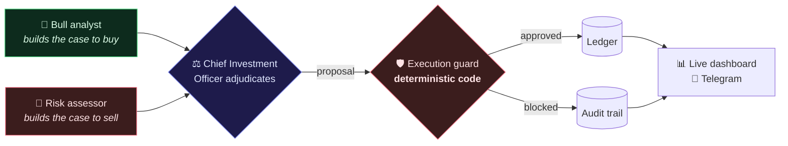

<div align="center">

# AlphaAgent

**An AI system that manages an investment portfolio — and can prove, months later, exactly why it made every decision it made.**

[](https://github.com/SergeyGer/AlphaAgent/actions/workflows/ci.yml)
[](https://github.com/SergeyGer/AlphaAgent/actions/workflows/codeql.yml)
[](https://github.com/SergeyGer/AlphaAgent/actions/workflows/docs.yml)
[](https://github.com/SergeyGer/AlphaAgent/wiki/Quality-and-Testing)
[](https://github.com/SergeyGer/AlphaAgent/wiki/Quality-and-Testing)
[](LICENSE)

[](https://www.python.org/)
[](https://www.djangoproject.com/)
[](https://www.postgresql.org/)
[](https://redis.io/)
[](https://docs.celeryq.dev/)
[](https://www.crewai.com/)
[](https://react.dev/)
[](https://www.typescriptlang.org/)
[](https://tailwindcss.com/)
[](https://docs.docker.com/compose/)

### ▶ [Try the live demo](https://alphaagent-6stcj667tqeawiupedhygh.streamlit.app/) — the real UI in a browser, no installation and no API keys

[See it running](#see-it-running) ·
[What this project demonstrates](#what-this-project-demonstrates) ·
[Skills](#skills-demonstrated) ·
[How it works](#how-it-works-in-one-minute) ·
[Run it yourself](#run-it-yourself) ·
[**Full technical wiki →**](https://github.com/SergeyGer/AlphaAgent/wiki)

</div>

---

## See it running


*Recorded from the live system — sign-in, portfolio metrics, the equity curve, an
agent debate expanding, news sentiment and the trade ledger.*

<details>
<summary><b>More screenshots</b> — dashboard, debate view, mobile</summary>

**The dashboard.** Equity curve, asset allocation, the stream of agent reasoning, pending approvals, trades, and news scored positive/negative.


**The debate view.** Expand any decision to read the bull case, the bear case and the adjudicator's verdict side by side.


**Mobile.** The same dashboard at a 414 px viewport.


</details>

---

## The problem worth solving

Everyone can wire a language model to a trading API in an afternoon. The reason
that is a bad idea is not the model — it is that **a language model cannot be
audited, and money demands that it can be.**

AlphaAgent is built around that constraint. Three AI agents research the market
and argue with each other. A separate, deterministic piece of software — not a
prompt, not another model — decides whether their proposal is allowed to become
a real transaction. Every decision, including every decision *not* to act, is
written to an audit trail with the full reasoning behind it.

The result is a system that behaves like an autonomous agent but is accountable
like a bank.

## How it works in one minute



**Why three agents and not one?** A single analyst feeding a single
decision-maker is a hallucination amplifier — whatever the analyst asserts
becomes the premise, and nothing argues the other side. Here a bull and a short
seller work from *different evidence* and are explicitly instructed to concede
when their case is weak. The short seller in one live run reported that it
"cannot build a credible bear case for Apple at current levels" — and the final
verdict cited that admission.

**Why a guard instead of trusting the model?** Position size, available cash,
concentration and the daily stop-loss are enforced in a pure function that is
unit-tested and has no knowledge of language models. The AI proposes; the code
decides. If the model is wrong, confused, or actively manipulated, the worst it
can do is make a suggestion that gets rejected.

## What this project demonstrates

Everything below is in this repository and runs today.

| Area | Delivered |
| --- | --- |
| **Multi-agent AI** | A three-agent adversarial debate on CrewAI, with a payload contract validated by a schema library and a guardrail that forces a retry on malformed output |
| **Risk engine** | A deterministic execution guard enforcing allocation, cash, position and stop-loss limits, designed as a pure function so it can be exhaustively tested |
| **Autonomous scheduling** | A task queue that fans out one independent job per portfolio-and-instrument pair, on a timer, with cooldowns that stop overlapping runs compounding exposure |
| **Decision audit trail** | Every run persisted with both sides of the argument, token usage and cost — queryable, streamable and prunable |
| **Live analytics dashboard** | A React and TypeScript single-page app with an equity curve, allocation breakdown, real-time reasoning feed, approvals and trade history, streamed over WebSocket |
| **Human-in-the-loop approvals** | Approve or reject any proposal from the dashboard or from Telegram, with the risk checks re-run against live prices at the moment of approval |
| **Tool server** | Market and news data published over the Model Context Protocol, so external AI tools can consume it without touching this codebase |
| **Telegram bot** | Inline-keyboard control: approvals, balance reports, open positions, pending queue, on-demand analysis, autopilot toggle |
| **Operations** | Containerised multi-service stack, health checks, a pruning command for the audit trail, and documented failure modes |
| **Quality gates** | 500 automated tests across both tiers, 77% backend coverage enforced, continuous integration on every push, static analysis, security scanning and automated dependency management |

## Skills demonstrated

> The short version: I designed, built, documented and operate a complete
> distributed system with AI at its core — and I can explain the trade-offs in
> every layer of it.

<table>
<tr><td width="50%" valign="top">

**Backend & data**
- Designing a relational schema with constraints and indexes that hold under concurrent writes
- Transactional integrity and row-level locking to make double-spending impossible
- A derived ledger — positions and profit recomputed from history rather than stored, so state can never drift
- REST API design with token authentication and per-user data isolation

**Distributed systems**
- Fan-out task architecture: one independent job per work item, no head-of-line blocking
- Scheduled background work with idempotency and throttling
- Real-time messaging over WebSockets with graceful reconnection

</td><td width="50%" valign="top">

**AI engineering**
- Multi-agent orchestration using an adversarial debate pattern rather than a single chain
- Provider-agnostic LLM integration across three vendors, with a deterministic fallback when none is configured
- Structured output contracts validated at the boundary, with automatic retry on malformed responses
- Publishing internal capabilities as a Model Context Protocol server

**Product & engineering judgement**
- Separating "what the model suggests" from "what is allowed to happen" — the central safety decision in the system
- Writing post-mortems for real defects found in production and fixing the root cause, not the symptom
- Documenting decisions and their trade-offs so a reviewer can challenge them

</td></tr>
</table>

## Under the hood

For reviewers who want the detail, the full engineering documentation lives in
the wiki:

| | |
| --- | --- |
| [**Architecture**](https://github.com/SergeyGer/AlphaAgent/wiki/Architecture) | System design, service topology, the decision pipeline end to end |
| [**Agent Debate**](https://github.com/SergeyGer/AlphaAgent/wiki/Agent-Debate) | How the three agents are prompted and why adversarial beats sequential |
| [**Execution Guard**](https://github.com/SergeyGer/AlphaAgent/wiki/Execution-Guard) | The risk model, its invariants, and why it is deterministic code |
| [**Data Model**](https://github.com/SergeyGer/AlphaAgent/wiki/Data-Model) | Schema, the derived ledger, concurrency control |
| [**Real-Time Layer**](https://github.com/SergeyGer/AlphaAgent/wiki/Real-Time-Layer) | WebSocket authentication, event model, reconnection |
| [**API Reference**](https://github.com/SergeyGer/AlphaAgent/wiki/API-Reference) | Every endpoint, with request and response shapes |
| [**Operations**](https://github.com/SergeyGer/AlphaAgent/wiki/Operations) | Runbook, scheduled jobs, failure modes |
| [**Engineering Decisions**](https://github.com/SergeyGer/AlphaAgent/wiki/Engineering-Decisions) | The trade-offs behind each significant choice |
| [**Architecture Decision Records**](docs/adr/README.md) | Eleven decisions, each with the alternatives that were rejected |
| [**Incident Log**](https://github.com/SergeyGer/AlphaAgent/wiki/Incident-Log) | Real defects, root-cause analysis and the fixes |
| [**Quality & Testing**](https://github.com/SergeyGer/AlphaAgent/wiki/Quality-and-Testing) | Test strategy, CI pipeline, security scanning |

**Also in the stack:** Django REST Framework · Django Channels (WebSockets) ·
Recharts · GitHub Actions

## Run it yourself

**Try the risk guard without an account, a key or a database:**

[](https://alphaagent-6stcj667tqeawiupedhygh.streamlit.app)

A single page that drives the project's **real risk guard** — the same
`services/execution.py` the live system runs — so you can push the sliders until
it refuses a trade and read its actual reason string.

If the hosted demo is not up, run the identical thing locally in two commands:

```bash
pip install -r demo/requirements.txt
streamlit run demo/app.py
```

**Or run the whole stack.** Two commands, no build step — the image is published
to GHCR:

```bash
docker compose -f docker-compose.ghcr.yml up
```

Open **<http://127.0.0.1:8000/>** and sign in as `demo` / `demo-pass-123`. The
demo credentials are committed on purpose so the stack starts with no
configuration at all; they are demo values, not secrets.

No API key is needed either — without one a deterministic engine keeps the whole
pipeline running so you can explore it offline.

<details>
<summary>Prefer to build from source?</summary>

```bash
git clone https://github.com/SergeyGer/AlphaAgent.git
cd AlphaAgent

cp .env.example .env
# Set DJANGO_SECRET_KEY and POSTGRES_PASSWORD (generate one with:
#   python3 -c "import secrets; print(secrets.token_urlsafe(64))")

docker compose up -d --build
docker compose exec web python manage.py seed_demo
```

</details>

To enable live AI reasoning, add an `AI_LLM_API_KEY` to `.env`. Full
configuration reference: [Configuration](https://github.com/SergeyGer/AlphaAgent/wiki/Configuration).

## Quality signals

| | |
| --- | --- |
| **500 automated tests** | 418 Python — risk guard, ledger, API, task pipeline, WebSockets, Telegram bot, tool server — plus 82 frontend (Vitest + Testing Library) covering the formatters, the WebSocket frame validator and the metric grid |
| **77% coverage, enforced** | CI fails below a 70% floor, and the badge above is regenerated from the real run on every push to `main` |
| **Continuous integration** | Lint, format, the full test suite against PostgreSQL 16, and a Docker image build — on every push |
| **Security scanning** | CodeQL analysis plus a test that walks every publishable file looking for committed credentials |
| **Supply chain** | Automated dependency updates, grouped and scheduled to stay reviewable |

## Roadmap

Cumulative daily deployment limits · backtesting against historical data ·
per-user strategy configuration · a hosted demonstration instance.

Full roadmap and rationale: [Roadmap](https://github.com/SergeyGer/AlphaAgent/wiki/Roadmap).

---

<div align="center">

**[Full technical wiki →](https://github.com/SergeyGer/AlphaAgent/wiki)**

MIT licensed · see [LICENSE](LICENSE) · contributions welcome, see [CONTRIBUTING.md](CONTRIBUTING.md)

</div>

<!--
Note to future maintainers: this README is deliberately aimed at a non-specialist
reader. Implementation detail belongs in the wiki, not here. If you are about to
add a code sample, an API table or an architecture diagram, it probably belongs on
the corresponding wiki page instead. Keep this file scannable in under two minutes.
-->
