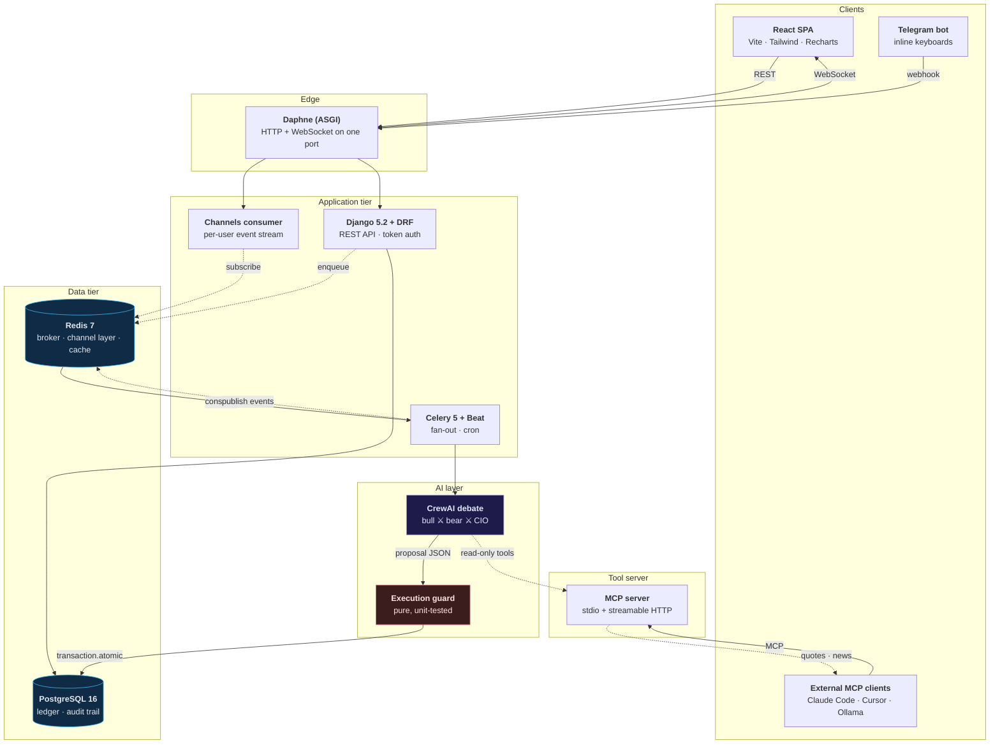
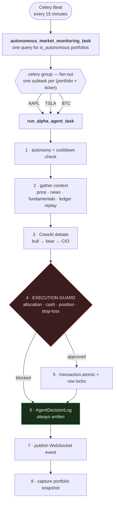
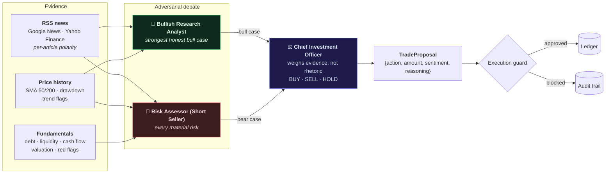
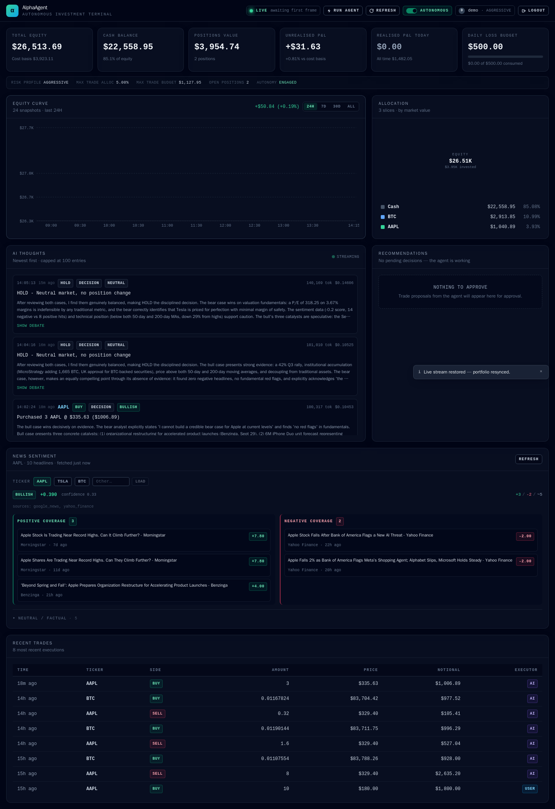
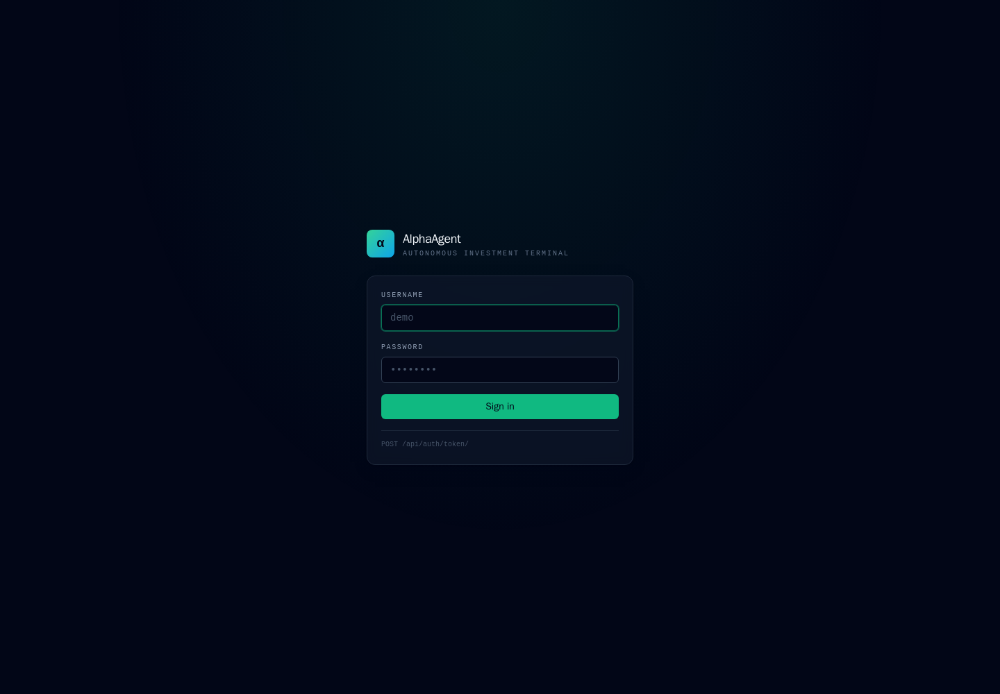
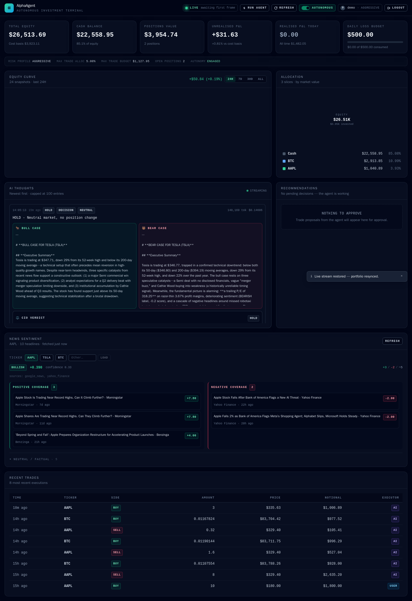
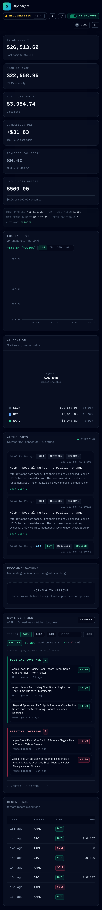

<div align="center">

# AlphaAgent

**Autonomous multi-agent investment platform — LLM-driven decisions, deterministic guardrails, full audit trail.**

[](https://github.com/SergeyGer/AlphaAgent/actions/workflows/ci.yml)
[](https://github.com/SergeyGer/AlphaAgent/actions/workflows/codeql.yml)
[](LICENSE)
[](https://www.python.org/)
[](#testing)
[](https://react.dev/)
[](#real-time-dashboard)
[](#telegram-bot)
[](#mcp-tool-server)
[](https://github.com/astral-sh/ruff)
[](CONTRIBUTING.md)

[Overview](#overview) ·
[Tech stack](#tech-stack) ·
[Architecture](#architecture) ·
[Quick start](#quick-start) ·
[Real-time dashboard](#real-time-dashboard) ·
[Multi-agent debate](#multi-agent-debate) ·
[MCP tool server](#mcp-tool-server) ·
[Telegram bot](#telegram-bot) ·
[API](#api-reference) ·
[Safety model](#safety-model) ·
[Testing](#testing) ·
[Roadmap](#roadmap)

</div>

---

## Overview

AlphaAgent is a self-hosted platform where a **CrewAI agent crew** researches the
market and proposes trades, while a **deterministic execution guard** decides
whether those proposals are allowed to touch the database. Every decision —
including the ones it declines to make — is recorded with its full chain of
thought.

It is built around one belief: an autonomous financial system is only as
trustworthy as its ability to explain and constrain itself.

| | |
| --- | --- |
| 🧠 **Three-agent debate** | A bull analyst and a short seller argue opposite cases from independent evidence; the CIO adjudicates. Nothing reaches a decision unchallenged. |
| 🛡️ **Guardrails that are code, not prompts** | Position sizing, cash limits and the daily stop-loss are enforced in a pure, unit-tested function — never delegated to the model. |
| 🔍 **Explainable by default** | Every run writes an audit row with the chain of thought, token usage and cost. HOLDs and rejections included. |
| ⚡ **Fan-out by design** | Celery Beat dispatches one independent task per `(portfolio, ticker)` pair — no nested loops, no head-of-line blocking. |
| 🔌 **Runs with or without an LLM** | No API key? A deterministic engine keeps the pipeline fully exercisable offline. |
| 📊 **Live dashboard** | A React SPA with an equity curve, allocation donut and a real-time feed of the agent's reasoning, streamed over WebSocket. |
| ✅ **Human in the loop** | Approve or reject any proposal from the dashboard or straight from Telegram - without bypassing the guardrails. |
| ⚔️ **Adversarial by design** | A bull analyst and a short seller argue opposite cases from independent evidence; the CIO adjudicates. One summary feeding one decision-maker is a hallucination amplifier. |
| 🔌 **Tools as a protocol** | News and market data are served over MCP, so Claude Code, Cursor or a local Ollama agent can use them without touching this codebase. |

## Tech stack

| Layer | Technology | Notes |
| --- | --- | --- |
| **API** | [Django 5.2 LTS](https://www.djangoproject.com/) · [Django REST Framework](https://www.django-rest-framework.org/) | Token auth, `select_related`/`prefetch_related`, bounded query counts |
| **Database** | [PostgreSQL 16](https://www.postgresql.org/) | `CHECK` constraints, `UNIQUE` constraints, hot-path indexes |
| **Async** | [Celery 5](https://docs.celeryq.dev/) · [Celery Beat](https://docs.celeryq.dev/en/stable/userguide/periodic-tasks.html) · [Redis 7](https://redis.io/) | Fan-out subtasks, cron scheduling, brokered results |
| **AI** | [CrewAI](https://github.com/crewAIInc/crewAI) · DeepSeek-R1 · GPT-4o · Claude | Three-agent adversarial debate, read-only tools, Pydantic-validated output |
| **Market data** | [yfinance](https://github.com/ranaroussi/yfinance) | Cached quotes with graceful degradation |
| **News** | RSS (Google News, Yahoo Finance) · [defusedxml](https://github.com/tiran/defusedxml) | Lexicon sentiment scoring, hardened XML parsing |
| **Validation** | [Pydantic v2](https://docs.pydantic.dev/) | The guardrail payload contract |
| **Real-time** | [Django Channels 4](https://channels.readthedocs.io/) · [Daphne](https://github.com/django/daphne) | WebSocket fan-out on a Redis channel layer |
| **Frontend** | [React 18](https://react.dev/) · [Vite](https://vitejs.dev/) · [TypeScript](https://www.typescriptlang.org/) · [Tailwind CSS](https://tailwindcss.com/) · [Recharts](https://recharts.org/) | Live analytics dashboard |
| **Tool protocol** | [Model Context Protocol](https://modelcontextprotocol.io/) | Market/news tools served to any MCP client |
| **Messaging** | [Telegram Bot API](https://core.telegram.org/bots/api) | Inline-keyboard approvals and reports |
| **Containers** | [Docker](https://www.docker.com/) · Docker Compose | Five services with healthchecks and restart policies |
| **Quality** | [Ruff](https://github.com/astral-sh/ruff) · [pre-commit](https://pre-commit.com/) · GitHub Actions · CodeQL | Lint, format, test, security scanning |

## Demo

A guided tour of the live application — sign-in, portfolio metrics, the equity
curve, the bull/bear debate, news sentiment and the trade ledger:


*Full quality: [docs/demo.mp4](docs/demo.mp4) (0.8 MB). The recording is taken
from the running stack, not a mockup.*

## Architecture



### The decision pipeline



The AI never writes to the database. It returns a proposal; the guard decides.
## Quick start

### Docker (recommended)

```bash
git clone https://github.com/SergeyGer/AlphaAgent.git
cd AlphaAgent

cp .env.example .env
# Set POSTGRES_PASSWORD and DJANGO_SECRET_KEY. Generate one with:
#   python -c "import secrets; print(secrets.token_urlsafe(64))"

docker compose up -d --build
docker compose exec web python manage.py seed_demo --autonomous --risk high \
    --balance 25000 --seed-position
```

`web`, `worker` and `beat` run with `restart: unless-stopped`, so the async tier
survives crashes and reboots. The demo token is printed by `seed_demo`.

```bash
curl -H "Authorization: Token <token>" http://127.0.0.1:8000/api/portfolio/
```

Open **<http://127.0.0.1:8000/>** and sign in with the demo credentials — the
dashboard connects over WebSocket and starts streaming immediately.

The React bundle is compiled **inside the Docker build** (a Node stage produces
`frontend/dist`, which the Python stage copies in). `dist/` is gitignored, as
build output should be, so a fresh clone needs no manual npm step. Running the
frontend from source instead:

```bash
cd frontend && npm install && npm run dev   # Vite on :5173, proxying to :8000
```

### Local processes

```bash
make env install-dev     # .env, virtualenv and dependencies
make up                  # PostgreSQL + Redis
make migrate seed        # schema + demo account

python manage.py runserver 127.0.0.1:8000
celery -A config worker -l info
celery -A config beat   -l info
```

> **Run one worker fleet, not two.** Celery has no queue ownership: a local
> worker and a containerised worker will compete for the same Redis queue, and
> two Beats will double every scheduled sweep. Mixing a stale worker with fresh
> code also produces a confusing mix of old and new behaviour in the audit trail.

Run `make help` to list every available target.

## Configuration

Configuration is environment-driven; see [`.env.example`](.env.example) for the
full annotated template. There are **no credential fallbacks in code** — the app
refuses to start without `POSTGRES_PASSWORD` and, when `DJANGO_DEBUG=false`,
without `DJANGO_SECRET_KEY`.

| Variable | Default | Purpose |
| --- | --- | --- |
| `DJANGO_SECRET_KEY` | *(required in prod)* | Django signing key; an ephemeral one is generated when `DEBUG=true` |
| `DJANGO_DEBUG` | `false` | Debug mode; also disables the browsable API when off |
| `DJANGO_ALLOWED_HOSTS` | `localhost,127.0.0.1` | Comma-separated hostnames |
| `POSTGRES_*` | — | `POSTGRES_PASSWORD` is mandatory |
| `CELERY_BROKER_URL` | `redis://127.0.0.1:6379/0` | Broker |
| `CELERY_RESULT_BACKEND` | `redis://127.0.0.1:6379/1` | Result backend |
| `AI_LLM_PROVIDER` | `deepseek` | `deepseek` \| `openai` \| `anthropic` \| `none` |
| `AI_LLM_MODEL` | `deepseek-reasoner` | Provider model ID |
| `AI_LLM_API_KEY` | *(empty)* | Empty ⇒ deterministic engine |
| `AI_ALLOW_HEURISTIC_FALLBACK` | `true` | `false` fails loudly instead of degrading |
| `ALPHA_WATCHLIST` | `AAPL,TSLA,BTC` | Tickers scanned alongside held assets |

### Enabling the LLM

```bash
AI_LLM_PROVIDER=anthropic
AI_LLM_MODEL=claude-sonnet-4-5-20250929
AI_LLM_API_KEY=sk-ant-...
```

Providers retire model IDs regularly. A dead ID returns `404 not_found_error`
*after* authentication succeeds, so it looks like a prompt failure. Verify what
your key can actually use:

```bash
docker compose exec worker python -c \
  "import os;from anthropic import Anthropic;print([m.id for m in Anthropic().models.list()])"
```

#### Anthropic Workspaces: the `anthropic-workspace-id` header

If your Anthropic account is split into Workspaces and the key is not scoped to
one, **every** request is rejected with:

```
HTTP 400 - This API key is not scoped to a workspace, so this request must
include the anthropic-workspace-id header with the ID of the workspace to use.
```

Neither CrewAI nor LiteLLM sends that header, so the app injects it:

```bash
AI_LLM_WORKSPACE_ID=ws_0123456789abcdef     # Console -> Settings -> Workspaces
```

For gateways and proxies, any header can be added:

```bash
AI_LLM_EXTRA_HEADERS={"x-gateway-token": "..."}   # JSON object
```

**How it works.** CrewAI exposes a documented transport hook,
`LLM(interceptor=...)`, which runs against the real `httpx.Request` before it
leaves the process. `services/llm_hooks.py` implements it as a genuine
`BaseInterceptor` subclass — CrewAI validates `isinstance`, so structural typing
is rejected:

```python
LLM(model="claude-sonnet-4-5-20250929", interceptor=HeaderInjectionInterceptor(
    {"anthropic-workspace-id": "ws_0123456789abcdef"}
))
```

No monkeypatching, no forking the provider. Verified end-to-end:
`test_llm_hooks.py` stands up a mock Anthropic endpoint on localhost, drives a
real CrewAI `LLM.call()`, and asserts the header arrives **on the wire** —
because an interceptor that is constructed correctly but never invoked would
pass every unit test and still fail in production.

The same hook can rewrite anything else the provider needs, and it logs an
actionable message when a rejection is workspace-related.

A misconfigured key can never place a trade: the pipeline logs the failure,
writes an audit row, and executes nothing. Errors are translated for the
operator — a workspace rejection, a retired model ID and a bad credential each
produce a specific, actionable message instead of a raw stack trace.

## API reference

All endpoints except `/healthz/` and `/api/auth/token/` require
`Authorization: Token <key>`.

| Method | Path | Description |
| --- | --- | --- |
| `POST` | `/api/auth/token/` | Obtain an auth token |
| `GET` | `/api/portfolio/` | Portfolio, nested assets and live metrics |
| `POST` | `/api/portfolio/toggle-autonomy/` | Safe `is_autonomous` switch |
| `GET` | `/api/portfolio/logs/` | AI decision audit trail |
| `GET` | `/api/portfolio/transactions/` | Trade ledger |
| `POST` | `/api/portfolio/run-agent/` | Enqueue an on-demand autonomous sweep |
| `GET` | `/api/portfolio/snapshots/` | Equity time series for the chart |
| `GET` | `/api/market/news/` | Headlines split into positive / negative / neutral |
| `POST` | `/api/portfolio/analyse/` | Advisory sweep - proposes, never executes |
| `GET` | `/api/portfolio/recommendations/` | Proposals awaiting a decision |
| `POST` | `/api/portfolio/recommendations/<id>/approve/` | Approve (re-validated, then executed) |
| `POST` | `/api/portfolio/recommendations/<id>/reject/` | Reject a proposal |
| `GET` | `/api/telegram/link/` | Current Telegram pairing |
| `POST` | `/api/telegram/link/` | Mint a pairing code |
| `POST` | `/api/telegram/webhook/` | Inbound Telegram updates |
| `GET` | `/healthz/` | Liveness probe |
| `WS` | `/ws/portfolio/?token=<key>` | Live event stream |
| `GET` | `/` | The compiled SPA, when built |

<details>
<summary><code>GET /api/portfolio/</code> — sample response</summary>

```json
{
  "id": 1,
  "username": "demo",
  "balance_usd": "23565.84",
  "risk_profile": "high",
  "risk_profile_display": "Aggressive",
  "is_autonomous": true,
  "max_trade_allocation_pct": "5.00",
  "max_trade_budget_usd": "1178.29",
  "daily_loss_limit_usd": "500.00",
  "metrics": {
    "cash_balance_usd": "23565.84",
    "positions_value_usd": "2928.00",
    "total_equity_usd": "26493.84",
    "invested_cost_usd": "2914.57",
    "unrealised_pnl_usd": "13.43",
    "unrealised_pnl_pct": "0.46",
    "realised_pnl_today_usd": "1482.05",
    "daily_loss_used_usd": "0.00",
    "daily_loss_remaining_usd": "500.00",
    "is_autonomy_blocked": false
  },
  "assets": [
    {
      "ticker": "BTC",
      "amount": "0.03465522",
      "avg_purchase_price": "83733.73",
      "market_price": "83016.77",
      "price_source": "yfinance",
      "market_value_usd": "2876.98",
      "unrealised_pnl_usd": "-24.84",
      "unrealised_pnl_pct": "-0.86",
      "allocation_pct": "10.86"
    }
  ]
}
```

</details>

**Filtering the audit trail:**

```bash
curl -H "Authorization: Token $TOKEN" \
  "http://127.0.0.1:8000/api/portfolio/logs/?sentiment=BEARISH&executed=true"
```

Supported query parameters: `sentiment`, `ticker`, `executed`, `since`.

## AI layer

Three agents run in a **sequential** CrewAI process, structured as an adversarial
debate. A single analyst feeding a single decision-maker is a hallucination
amplifier — whatever the analyst asserts becomes the premise, and nothing argues
the other side.



### Agent responsibilities

| Agent | Tools | Mandate |
| --- | --- | --- |
| **Bullish Research Analyst** | `get_news_sentiment`, `get_price_history` | Build the strongest *honest* bull case: catalysts, upgrades, momentum. Must acknowledge and rebut the main counter-argument, and say so plainly when the bullish evidence is weak. |
| **Risk Assessor (Short Seller)** | `get_financial_health`, `get_price_history`, `get_news_sentiment` | Find every material risk: leverage, liquidity, cash burn, valuation stretch, technical breakdown. Must state explicitly when it **cannot** find a credible bear case — fabricating a risk is as damaging as missing one. |
| **Chief Investment Officer** | `get_market_price` | Adjudicate on evidence rather than rhetoric. Weigh the stronger argument, respect the risk mandate and cash budget, and return HOLD when the cases genuinely balance. |

Both arguments are persisted on the decision log (`bull_case`, `bear_case`) and
streamed to the dashboard, so any verdict can be traced back to the two cases
that produced it.

The crew must emit exactly this payload:

```json
{"action": "BUY"|"SELL"|"HOLD", "amount": 0.0,
 "sentiment": "BULLISH"|"BEARISH"|"NEUTRAL", "reasoning": "..."}
```

It is validated **twice** — by a Pydantic `TradeProposal` model
(`output_pydantic`) and by a CrewAI task `guardrail` that re-parses the raw text
and forces a retry on malformed JSON, with `json_repair` as a last resort.

### Safe validation

Exercise the full crew against the live LLM **without touching the database**:

```bash
docker compose exec web python manage.py dry_run_agent --portfolio-id 1
```

It prints the inputs, the validated proposal, token usage, cost and the full
chain of thought — and never calls the execution guard.

### Graceful degradation

With no API key configured, decisions come from a deterministic engine that
applies the same inputs through explicit rules, marked `[DETERMINISTIC ENGINE]`
in the audit trail. Set `AI_ALLOW_HEURISTIC_FALLBACK=false` to fail loudly
instead — recommended when real money depends on the model.

## Real-time dashboard



A React SPA lives in [`frontend/`](frontend/). Django serves the compiled build
at `/`, so a fresh `docker compose up` gives you a working UI with no extra
services. In development, run Vite alongside Django for hot reload.

`frontend/dist` is gitignored (build output does not belong in a repository),
so the Docker image compiles it in a dedicated Node stage. A fresh clone needs
no manual npm step. For frontend work with hot reload:

```bash
cd frontend && npm run dev   # Vite on :5173, proxying /api and /ws to :8000
```

| Panel | What it shows |
| --- | --- |
| **Metric cards** | Total equity, cash, positions value, unrealised and realised P&L, and the remaining daily loss budget as a progress bar |
| **Equity curve** | Area chart of portfolio value over time, with 24H / 7D / 30D / ALL ranges |
| **Asset allocation** | Donut by market value, including a cash slice, with a ticker/value/percentage legend |
| **AI thoughts feed** | The agent's reasoning streamed live, with sentiment badges, token counts, cost, and expandable chain-of-thought |
| **Approvals** | Pending recommendations with Approve / Reject buttons |
| **Trades** | Recent executions with side, size, price and executor (AI or USER) |
| **News sentiment** | Coverage split into positive and negative columns with per-article polarity |
| **Debate view** | Expand any decision to read the bull case, the bear case and the CIO's verdict side by side |

<details>
<summary>All screenshots (4)</summary>

**Sign-in** — token authentication against the DRF API.



**Debate view** — the bull case, the bear case and the CIO's verdict, side by side.



**Mobile layout** — the same dashboard at a 414 px viewport.



</details>

### How the live stream works

`services/events.py` is the single publishing point. Celery tasks call typed
helpers (`emit_decision`, `emit_trade`, `emit_agent_thinking`, ...), which push
to a per-user Redis group. The consumer relays frames verbatim:

```
Celery task ──► services.events.publish() ──► Redis group "portfolio.<user_id>"
                                                      │
                                          PortfolioConsumer ──► browser
```

```
ws://<host>/ws/portfolio/?token=<drf-token>

{"type": "agent.thinking",          "payload": {...}}   # live progress
{"type": "decision.created",        "payload": {...}}   # feeds the thoughts feed
{"type": "trade.executed",          "payload": {...}}
{"type": "recommendation.created",  "payload": {...}}
{"type": "portfolio.snapshot",      "payload": {...}}
{"type": "autonomy.changed",        "payload": {...}}
```

Design guarantees:

- **The socket is read-only.** A client frame can only be `{"type": "ping"}`.
  Every mutation still goes through the REST API, where authentication,
  validation and the execution guard apply.
- **Users are isolated.** Each socket joins exactly one group, derived from the
  authenticated user id; a test asserts one user's events never reach another's.
- **Realtime is never the critical path.** If Redis or the channel layer is
  down, `publish()` logs and returns `False`. A live-update failure can never
  fail a trade.
- **Bad tokens get a meaningful close.** The socket accepts, then closes with
  code `4401`, so the SPA can tell "your token is invalid" from "you are
  offline". Connections are origin-validated against `ALLOWED_HOSTS` to block
  cross-site WebSocket hijacking.

## Human in the loop

Autonomous execution is not the only mode. In **advisory mode** the AI still
analyses and proposes, but a human decides:

```
AI proposes ──► PENDING TradeRecommendation ──► approve / reject
                        │                          (dashboard or Telegram)
                        ▼
              re-validated against LIVE prices and limits
                        │
              ┌─────────┴─────────┐
              ▼                   ▼
          EXECUTED             BLOCKED
```

**Approving is not a bypass.** A proposal that was valid when the AI made it may
be stale, over-budget or past the stop-loss by the time someone taps the button,
so the *same* `evaluate_proposal()` guard runs again against current prices.
Tests cover a price spike that gets clamped to the ceiling, an expired proposal,
and a double approval attempt.

Pending proposals expire automatically (`RECOMMENDATION_TTL_MINUTES`, default
60), because a stale trade idea is worse than no trade idea.

## Multi-agent debate

A single analyst feeding a single decision-maker is a hallucination amplifier:
whatever the analyst asserts becomes the premise, and nothing ever argues the
other side. The crew is therefore adversarial.

```
        ┌──────────────────────┐        ┌──────────────────────┐
        │  Bullish Analyst     │        │  Risk Assessor       │
        │  "why this rises"    │        │  (Short Seller)      │
        │                      │        │  "what breaks"       │
        │  news · trend        │        │  news · fundamentals │
        │                      │        │  · price history     │
        └──────────┬───────────┘        └───────────┬──────────┘
                   │        independent evidence    │
                   └───────────────┬────────────────┘
                                   ▼
                        ┌──────────────────────┐
                        │  CIO (adjudicator)   │
                        │  weighs, then decides│
                        └──────────┬───────────┘
                                   ▼
                   {"action": ..., "reasoning": "which argument won, and why"}
```

Each side argues from **its own** evidence, so disagreement is real rather than
staged:

| Agent | Tools | Mandate |
| --- | --- | --- |
| **Bullish Research Analyst** | news, price history | Strongest honest bull case. Must acknowledge and rebut the counter-argument, and say so when the bullish evidence is weak. |
| **Risk Assessor (Short Seller)** | news, fundamentals, price history | Every material risk: leverage, liquidity, cash burn, valuation stretch, technical breakdown. Must state plainly when it *cannot* find a credible bear case - fabricating risk is as damaging as missing it. |
| **CIO** | live price | Adjudicates on evidence, not rhetoric. HOLD is an acceptable verdict when the cases balance. Records which argument won and names the strongest point on the losing side. |

Both write-ups are persisted on the `AgentDecisionLog` (`bull_case`,
`bear_case`) and streamed to the dashboard, so every verdict can be audited back
to the arguments that produced it. Without an LLM, the deterministic engine
still produces both sides from the same data - and labels them as a mechanical
read rather than a reasoned case.

### News split

Headlines are scored individually, so bullish and bearish coverage can be
presented separately instead of as one blended number:

```bash
curl -H "Authorization: Token $TOKEN" \
  "http://127.0.0.1:8000/api/market/news/?ticker=TSLA&limit=10"
```

```json
{
  "ticker": "TSLA",
  "sentiment": { "label": "BEARISH", "score": -0.225, "confidence": 0.28 },
  "positive": [ { "title": "...", "polarity": 2.0, "sentiment": "BULLISH" } ],
  "negative": [ { "title": "...", "polarity": -6.0, "sentiment": "BEARISH" } ],
  "neutral":  [ { "title": "...", "polarity": 0.0, "sentiment": "NEUTRAL"  } ]
}
```

## MCP tool server

The news scraper and market-data client were private Python functions reachable
only from inside the crew. `mcp_server/` exposes them over the
[Model Context Protocol](https://modelcontextprotocol.io/), which turns them
into a **protocol-level capability** any MCP client can use.

| Tool | Returns |
| --- | --- |
| `get_market_price` | Latest quote, change %, source |
| `get_news_sentiment` | Headlines with per-article polarity and an aggregate score |
| `get_price_history` | Daily closes, SMA 50/200, drawdown, trend flags |
| `get_financial_health` | Debt, liquidity, cash flow, valuation, derived red flags |
| `get_market_snapshot` | All of the above in one round trip |
| `list_watchlist` | Tickers this deployment tracks |

### Use it from anywhere

```bash
# stdio - how Claude Code and Cursor launch a server
python -m mcp_server

# streamable HTTP - the containerised microservice
python -m mcp_server --transport http --port 8100
# endpoint: http://localhost:8100/mcp
```

Register it with Claude Code:

```bash
claude mcp add alphaagent -- python -m mcp_server
```

Or in any MCP client config:

```json
{
  "mcpServers": {
    "alphaagent": { "command": "python", "args": ["-m", "mcp_server"] }
  }
}
```

### The crew can use it too

Set `AI_TOOLS_VIA_MCP=true` and the agents source their tools from the MCP
server instead of calling the service layer in-process — the same server
external clients use, with a per-agent `tool_filter` so the Risk Assessor still
gets the fundamentals tool and the CIO does not:

```bash
AI_TOOLS_VIA_MCP=true
AI_MCP_SERVER_URL=http://mcp:8100/mcp
```

Verified against the real client: `CrewBuildTests` builds the crew in both
modes, and `test_mcp.py` drives the server through the official MCP SDK over
both stdio and HTTP.

### Safety boundary

**No MCP tool touches the database.** There is no tool that reads a portfolio,
lists positions, or places a trade — a test asserts that calling every tool
issues *zero* ORM queries. Execution stays behind the REST API and its guard, so
even a fully compromised MCP client cannot move money.

Two operational details worth knowing: under the stdio transport, stdout carries
the protocol, so all logging is forced to stderr (a stdout log line would
corrupt the framing); and the HTTP transport publishes port 8100 — drop that
mapping if only the worker needs it.

## Telegram bot

Control the portfolio and approve trades from a chat. All UI text is English.

```bash
TELEGRAM_BOT_TOKEN=123456:ABC...        # from @BotFather
TELEGRAM_WEBHOOK_SECRET=<random-string> # production only
```

Then either register the webhook, or poll locally:

```bash
# Development (no public URL needed)
python manage.py telegram_poll

# Production
curl -X POST "https://api.telegram.org/bot$TOKEN/setWebhook" \
     -d "url=https://your-host/api/telegram/webhook/" \
     -d "secret_token=$TELEGRAM_WEBHOOK_SECRET"
```

Linking: `GET/POST /api/telegram/link/` mints a short-lived code; the user sends
`/start <code>` to the bot.

| | |
| --- | --- |
| **Commands** | `/start`, `/balance`, `/positions`, `/thoughts`, `/pending`, `/analyse`, `/pause`, `/resume`, `/unlink`, `/help` |
| **Buttons** | ✅ Approve Trade · ❌ Reject Trade · 🧠 Full Reasoning · 📊 Balance Report · 📈 Open Positions · 🗂 Pending Approvals · 🔍 Analyse Now · ⏸ Pause / ▶️ Resume Autopilot |

Security properties:

- **Ownership is re-checked server-side on every callback.** `callback_data` is
  client-supplied and therefore forgeable; acting on a recommendation requires
  that it belongs to the chat's linked user. A test has one user attempt to
  approve another's trade and asserts nothing happens.
- **The webhook is authenticated** with Telegram's `secret_token` header,
  compared in constant time.
- **Notifications are best-effort.** A Telegram outage logs and returns an error
  status; it never breaks a trade or a sweep.
- **Trade approvals say what they are.** The confirmation includes quantity,
  price, notional and sentiment, so nobody approves a number they cannot see.

## Safety model

`evaluate_proposal()` in [`tasks.py`](tasks.py) is a **pure function**: every
guardrail is unit-testable without I/O, and nothing reaches
`transaction.atomic()` until it approves.

| # | Rule |
| --- | --- |
| 1 | `HOLD` never reaches the database. |
| 2 | A live price is mandatory for any execution. |
| 3 | `amount × price` must fit `max_trade_allocation_pct` of cash — overshoot is **clamped** down to the ceiling and audited. |
| 4 | A BUY cannot exceed available cash; a SELL cannot exceed the held position. |
| 5 | Once `daily_loss_limit_usd` is breached, new risk is frozen but de-risking remains available. |
| 6 | Execution takes `select_for_update()` row locks and re-validates under the lock. |

Beyond the guard, the platform assumes failure is normal:

- **Market data down?** Redis cache → `yfinance` → stored cost basis → `None`.
  The API still returns `200` with `"price_source": "fallback"`, and the guard
  refuses to trade without a reliable price.
- **LLM down or returning garbage?** Fall back deterministically, or fail
  loudly — your choice — but never crash the sweep.
- **One ticker failing?** Each subtask is isolated; the rest of the sweep
  completes.
- **Audit gaps?** None. Executed trades, HOLDs, blocked proposals and crashes
  all write an `AgentDecisionLog` row.

## Testing

```bash
make test                 # 324 tests
make test-guardrails      # the safety-critical subset
```

| Module | Covers |
| --- | --- |
| `test_guardrails.py` | Every allocation, stop-loss and position rule |
| `test_recommendations.py` | Approval lifecycle, re-validation, clamping, expiry, debate persistence |
| `test_websockets.py` | Socket auth, per-user isolation, event relay, publish failures |
| `test_mcp.py` | MCP protocol, tool payloads, crew MCP routing, no-DB guarantee |
| `test_throttle.py` | Cooldown/debounce effectiveness, isolation, fail-open |
| `test_llm_hooks.py` | Workspace header on the wire, extra headers, diagnosis |
| `test_telegram.py` | Linking, buttons, approvals, cross-user access attempts |
| `test_dashboard_api.py` | Snapshots, approvals API, SPA serving, path traversal |
| `test_security.py` | Secret scanning, mandatory-env enforcement |
| `test_ai_agent.py` | Payload contract, JSON parsing, sizing, live crew construction |
| `test_tasks.py` | Fan-out, execution, clamping, rollback, halt sweep |
| `test_api.py` | Auth, all endpoints, query-count bounds, degradation |
| `test_services.py` | Sentiment, RSS/XML hardening, ledger replay, price fallbacks |
| `test_models.py` | Schema contract, defaults, database constraints |

No test touches the network: `yfinance` and the RSS layer are patched, and the
cache is switched to `LocMemCache`.

## Project structure

```
AlphaAgent/
├── manage.py                  # entrypoint; fixes up a read-only HOME first
├── runtime_env.py             # redirects third-party storage into .runtime/
├── ai_agent.py                # CrewAI crew, read-only tools, guardrail, fallback
├── tasks.py                   # fan-out, execution guard, the only DB mutation path
├── Dockerfile                 # one image serving web / worker / beat
├── docker-compose.yml         # db, redis, web, worker, beat
├── telegram_bot.py            # Bot API client, keyboards, update routing
├── mcp_server/                # MCP tool microservice (stdio + HTTP)
├── config/                    # settings, celery app, urls, asgi/wsgi
│   └── asgi.py                # ProtocolTypeRouter: HTTP + WebSocket
├── core/
│   ├── models.py              # Portfolio, Asset, Transaction, AgentDecisionLog,
│   │                          #   PortfolioSnapshot, TradeRecommendation, TelegramLink
│   ├── consumers.py           # WebSocket consumer (per-user group)
│   ├── ws_auth.py             # token auth for the socket handshake
│   ├── spa.py                 # serves the compiled React build
│   ├── serializers.py         # nested portfolio payloads and metrics
│   ├── views.py               # REST endpoints
│   ├── exceptions.py          # consistent error envelope
│   ├── management/commands/   # seed_demo, dry_run_agent, telegram_poll,
│   │                          #   purge_decision_logs
│   ├── migrations/
│   └── tests/
├── services/                  # market_data, news, sentiment, ledger, metrics,
│                              #   execution, recommendations, snapshots, events,
│                              #   throttle, llm_hooks
└── frontend/                  # React + Vite + Tailwind + Recharts SPA
```

## Operations

### Sweep throttling

`max_trade_allocation_pct` is a **per-trade** ceiling, so on its own it does not
bound a *sequence* of trades. Two sweeps landing close together could each buy
inside their own limit and compound the portfolio's real exposure — observed in
practice when a Beat sweep and a manual trigger fired three seconds apart and
AAPL was bought twice.

Two Redis-backed guards prevent it:

| Guard | Default | Effect |
| --- | --- | --- |
| **Ticker cooldown** | 900 s (`ALPHA_TICKER_COOLDOWN_SECONDS`) | One `(portfolio, ticker)` pair runs at most once per window. A second run returns `{"status": "cooldown"}` instead of spending tokens and re-trading. |
| **Sweep debounce** | 60 s (`ALPHA_SWEEP_DEBOUNCE_SECONDS`) | Prevents duplicate *fan-outs*, so Beat and a manual trigger cannot both dispatch. |

The cooldown uses `cache.add()` (an atomic `SET NX`), so two workers racing for
the same ticker cannot both win. Both guards **fail open**: if Redis is
unavailable the run proceeds with a warning. Losing a cooldown costs money;
refusing to run the risk engine costs safety.

This bounds *automatic* compounding but is still not a cumulative spend limit.
For real capital, pair it with a daily deployment ceiling (see the roadmap).

### Maintaining the audit trail

The decision log is append-only, so a misconfiguration can flood it: a revoked
key produced 172 identical `ERROR` rows in a few hours.

```bash
python manage.py purge_decision_logs                          # report only
python manage.py purge_decision_logs --errors-only --dry-run  # preview
python manage.py purge_decision_logs --errors-only            # delete failures
python manage.py purge_decision_logs --older-than 90          # retention policy
```

Running it with no selector **lists the contents and exits** rather than
deleting anything. It refuses to delete any row linked to an executed trade, so
the record of what the system actually did is never lost to a cleanup.

### Provider troubleshooting

Failures that are really configuration mistakes are translated before they reach
the audit trail, so the log says what to change:

| Provider response | What the log says |
| --- | --- |
| `400` mentioning a workspace | Set `AI_LLM_WORKSPACE_ID`, or use a workspace-scoped key |
| `404 not_found_error` for a model | The model ID has been retired — check what your key can use |
| `401` / invalid API key | The credentials were rejected |

## Deployment notes

- **Behind TLS**, enable `DJANGO_SECURE_SSL_REDIRECT`,
  `DJANGO_SESSION_COOKIE_SECURE`, `DJANGO_CSRF_COOKIE_SECURE` and
  `DJANGO_SECURE_HSTS_SECONDS`. They default to off because the bundled stack
  serves plain HTTP. See [SECURITY.md](SECURITY.md) for the full checklist.
- **Scale the worker, not the beat.** Run exactly one scheduler.
- **Sweep concurrency.** `max_trade_allocation_pct` is a *per-trade* ceiling. Beat
  fires every 15 minutes and `POST /run-agent/` has no cooldown, so overlapping
  sweeps can compound exposure. Each trade is individually capped and row-locked,
  but a cumulative daily cap or a per-ticker cooldown is worth adding if you run
  this with real capital — see the roadmap.

## Roadmap

Contributions welcome — see [CONTRIBUTING.md](CONTRIBUTING.md).

**Risk & execution**
- Cumulative daily deployment cap, complementing the per-trade ceiling
  (the per-ticker cooldown now ships — see [Operations](#operations))
- Multi-step approval chains (two-person rule) for large tickets
- Trailing stop-loss and take-profit orders
- Order types beyond market (limit, TWAP) and partial fills
- Real broker integration (Alpaca, Interactive Brokers) behind the existing guard

**AI layer**
- Backtesting harness replaying historical news against the crew
- Portfolio-level agent reasoning across correlated positions
- Retrieval-augmented analysis over SEC filings and earnings calls
- Multi-model voting with disagreement detection
- Prompt-injection defences and evaluation suite for tool output

**Platform**
- Prometheus metrics and OpenTelemetry tracing
- `django-celery-beat` for database-backed schedules
- Per-user rate limiting and API key scoping
- Position/P&L snapshot table for fast historical drawdown analysis

**Engineering**
- Property-based tests (Hypothesis) for the guard and ledger replay
- Mutation testing to prove the guardrail tests bite
- Load testing the fan-out at scale
- Multi-architecture image builds (arm64)

## Adapting this repository

This repository is configured for `SergeyGer/AlphaAgent`. If you fork it,
update these before relying on them:

- The owner in the badge URLs above, in
  [`.github/ISSUE_TEMPLATE/config.yml`](.github/ISSUE_TEMPLATE/config.yml) and in
  [CHANGELOG.md](CHANGELOG.md)
- The copyright holder in [LICENSE](LICENSE)
- Contact details in [CODE_OF_CONDUCT.md](CODE_OF_CONDUCT.md)

Then verify:

```bash
make check                              # lint, format, checks, migrations, tests
docker compose config --quiet            # compose is valid
docker compose up -d --build             # the stack builds and starts
```

Rotate any credential that has ever been committed — purging it from the latest
commit is not enough; assume it is compromised and rewrite history.

## Contributing

See [CONTRIBUTING.md](CONTRIBUTING.md). Security issues: [SECURITY.md](SECURITY.md).

## License

[MIT](LICENSE) © 2026 AlphaAgent contributors

<div align="center">
<sub>Not investment advice. This software executes trades autonomously — use it with capital you can afford to lose.</sub>
</div>
