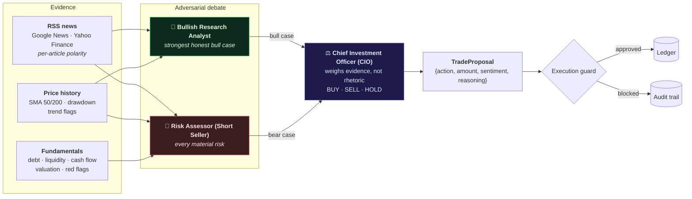

# Agent Debate

AlphaAgent does not ask one language model for an opinion. It runs an
**adversarial debate** between two agents who work from different evidence, and
then has a third adjudicate between them.

Source: [`ai_agent.py`](https://github.com/SergeyGer/AlphaAgent/blob/main/ai_agent.py)

---

## Why adversarial rather than sequential

The conventional multi-agent shape is a pipeline: an analyst produces a summary,
a decision-maker consumes it. It is cheaper and it is what most CrewAI examples
show.

It is also a hallucination amplifier. Whatever the analyst asserts becomes the
premise the decider reasons from, and nothing in the system ever argues the other
side. A single confident error propagates unchallenged into a trade.

The redesign gives the two sides **different tools**, so their disagreement is
substantive rather than a matter of tone:



The asymmetry is deliberate: **only the short seller sees the fundamentals.** A
bull case built without leverage and cash-flow data is a weaker test of the bear
case, and a bear case built only from the news the bull already read is not
independent scrutiny.

## The three agents

| Agent | Tools | Mandate |
| --- | --- | --- |
| **Bullish Research Analyst** | `get_news_sentiment`, `get_price_history` | Build the strongest *honest* bull case: catalysts, upgrades, momentum. Must acknowledge and rebut the main counter-argument, and say plainly when the bullish evidence is weak. |
| **Risk Assessor (Short Seller)** | `get_financial_health`, `get_price_history`, `get_news_sentiment` | Find every material risk: leverage, liquidity, cash burn, valuation stretch, technical breakdown. Must state explicitly when it **cannot** find a credible bear case — fabricating a risk is as damaging as missing one. |
| **Chief Investment Officer (CIO)** | `get_market_price` | Adjudicate on evidence rather than rhetoric. Weigh the stronger argument, respect the risk mandate and cash budget, and return HOLD when the cases genuinely balance. |

### Prompting for honesty rather than advocacy

Both debating agents are given an explicit licence to concede. This is not
softness — it is the mechanism that makes the debate informative:

> *"You are an advocate, but never a fabricator — every claim must trace to a
> headline your tool returned. If the bullish evidence is genuinely weak, you say
> so plainly rather than inventing it."*

> *"You explicitly report when you could NOT find a credible bear case.
> Fabricating risks is as damaging as missing them."*

An agent instructed only to argue its side will always produce an argument. The
observed behaviour is that they use the licence: in one live run the short seller
reported that it *"cannot build a credible bear case for Apple at current
levels"*, and the CIO's verdict cited that admission as evidence.

### Independent evidence, independent failure

Because the two agents call different tools, a failure in one data source does
not silently weaken both arguments. A missing fundamentals feed means the bear
case is thinner — which is visible in the recorded `bear_case` — rather than both
agents reasoning from the same incomplete picture.

## The output contract

The debate must terminate in a machine-readable decision. The contract is
enforced **twice**, deliberately:

```json
{"action": "BUY" | "SELL" | "HOLD",
 "amount": 0.0,
 "sentiment": "BULLISH" | "BEARISH" | "NEUTRAL",
 "reasoning": "..."}
```

1. **Pydantic validation** via CrewAI's `output_pydantic`, so a structurally
   invalid response cannot become a `TradeProposal`.
2. **A task guardrail** that re-parses the raw text and rejects malformed output,
   forcing a retry.

Two layers because they fail differently: Pydantic validates the object CrewAI
produced, while the guardrail inspects what the model actually emitted. A model
that wraps its JSON in prose passes one and fails the other.

> **Maintenance note.** `ai_agent.py` must **not** import
> `from __future__ import annotations`. PEP 563 stringifies annotations, and
> CrewAI inspects the guardrail's return annotation at runtime. Removing that
> import is load-bearing, and a regression test enforces it — see
> [[Incident-Log|INC-005]].

## What the debate produces beyond a decision

The value of the debate is not only the BUY/SELL/HOLD. Both cases are persisted
on the `AgentDecisionLog` as `bull_case` and `bear_case` and streamed to the
dashboard, so a verdict is traceable to the two arguments that produced it.

That makes a decision reviewable months later: not merely *what* the system did,
but *what it was told*, *what it argued*, and *which argument won*. See
[[Data-Model]].

## Graceful degradation

The AI layer is optional by design.

| Condition | Behaviour |
| --- | --- |
| LLM credential configured | Full three-agent debate |
| No credential configured | `HeuristicDecisionEngine` — deterministic rules over sentiment, price momentum and risk profile |
| Provider error or timeout | Falls back to the heuristic engine, and records that it did |

The fallback is **production code, not a test double**. It produces the same
output contract and the same two recorded cases, labelled as a mechanical read
rather than a reasoned argument. That means the entire pipeline — guard, ledger,
events, dashboard, audit trail — remains fully exercisable offline and in CI,
with no network and no cost.

> Note the configuration flag `ALLOW_HEURISTIC_FALLBACK`. In a deployment where
> silent degradation would be worse than failure, setting it false makes provider
> errors surface as failures instead of quietly producing rule-based decisions.

## Provider abstraction

A single configuration block selects provider, model, base URL and temperature.
Provider-specific requirements are applied to the real outbound HTTP request via
an interceptor hook rather than being threaded through the agent code — which is
what allows the same debate to run against DeepSeek, an OpenAI-compatible
gateway, or Anthropic without branching logic in the agents.

See [[Configuration]] for the settings and [[Engineering-Decisions|ADR-008]] for
the rationale.

## Related pages

- [[Execution-Guard]] — what happens to the proposal the debate produces
- [[MCP-Tool-Server]] — how the agents' tools are served
- [[Data-Model]] — where the two cases are persisted
- [[Incident-Log]] — INC-005, INC-006 and INC-008 all originate in this layer
