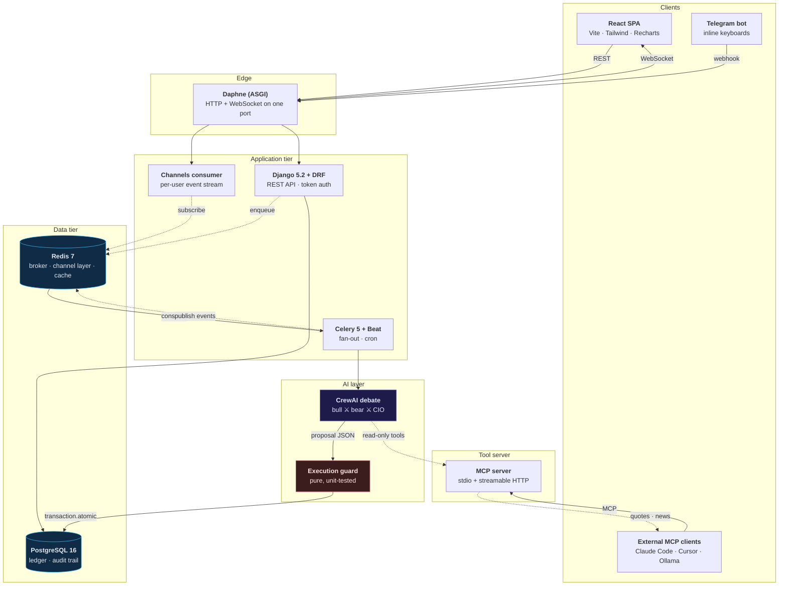
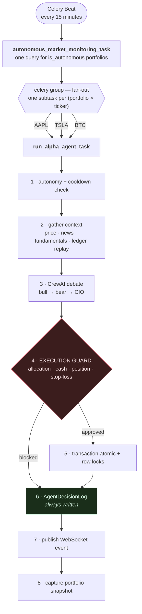

# Architecture

This page documents how AlphaAgent is put together and why. For the trade-offs
behind individual choices see [[Engineering-Decisions]]; for defects found in
this design and how they were fixed see [[Incident-Log]].

## System overview

Six containers, four logical tiers. Only the web tier is reachable from outside;
everything else talks over an internal Docker network.



### Why ASGI and not WSGI

The platform streams agent reasoning to the browser as it happens. WSGI is a
synchronous request/response protocol and cannot hold a WebSocket open, so the
web tier runs **Daphne** (ASGI) instead of gunicorn. This is not cosmetic: an
earlier iteration deployed gunicorn and the dashboard silently had no real-time
feed at all — the WebSocket upgrade was simply refused. See
[[Real-Time-Layer]] for the connection lifecycle.

> **Deployment note.** The container command must be a YAML *list*, not a folded
> scalar (`>`). A folded scalar preserves the newlines of more-indented
> continuation lines, which silently truncated the command to just
> `gunicorn config.wsgi:application` — gunicorn then fell back to its defaults
> (`127.0.0.1:8000`, one worker) and was unreachable from the host.

## The decision pipeline



The AI never writes to the database. It returns a proposal; the guard decides.

### Step by step

| Step | What happens | Failure behaviour |
| --- | --- | --- |
| 1 | Re-check that the portfolio is still autonomous, and claim a throttle slot | Run is skipped if autonomy was revoked or the cooldown is active |
| 2 | Gather context: live quote, scored news, fundamentals, and a ledger replay for current position and cost basis | Missing market data degrades to `HOLD`; it does not abort |
| 3 | Run the three-agent debate over read-only tools | Falls back to the deterministic engine when no LLM credential is configured |
| 4 | Evaluate the proposal against every risk limit | Blocked proposals are recorded with the reason code |
| 5 | Persist the trade inside a transaction with row locks | Rolled back atomically on any error |
| 6 | Write the audit row — **always**, approved or not | This is the only step with no conditional path |
| 7 | Publish an event to the user's WebSocket group | Fire-and-forget; never raises into the trading path |
| 8 | Capture a portfolio snapshot for the equity curve | Scheduled separately as well |

### Fan-out, not a loop

The monitoring task does **not** iterate over tickers and run the agent inline.
It queries the autonomous portfolios once and dispatches a Celery group of
independent subtasks:

```python
group(run_alpha_agent_task.s(portfolio.id, ticker) for ticker in watchlist).apply_async()
```

A slow LLM call for one instrument therefore cannot delay the next one, and a
failure is contained to a single `(portfolio, ticker)` pair. Because each subtask
is independent, retries are safe and the queue depth is a direct measure of
outstanding work.

## Layer responsibilities

| Layer | Owns | Explicitly does **not** |
| --- | --- | --- |
| REST API | Authentication, ownership scoping, serialisation, query efficiency | Business rules about trades |
| Channels consumer | Fan-out of events to the owning user only | Any persistence |
| Celery workers | Scheduling, orchestration, calling the AI, calling the guard | Deciding whether a trade is allowed |
| AI layer | Producing a proposal with reasoning | Writing to the database |
| Execution guard | Deciding whether a proposal may execute | Knowing anything about LLMs |
| MCP server | Serving read-only market and news data | Touching the database or placing trades |

That last row is the load-bearing one. The guard is a pure function — same
inputs, same verdict, no I/O, no model — which is what makes the risk behaviour
exhaustively testable. See [[Execution-Guard]].

## Data flow for one autonomous decision

```
Celery Beat (15 min)
   └─► monitoring task ──► group of subtasks
                              └─► run_alpha_agent_task(portfolio, ticker)
                                     ├─ MCP / yfinance / RSS ──► context
                                     ├─ CrewAI debate ─────────► TradeProposal
                                     ├─ evaluate_proposal() ───► GuardDecision
                                     ├─ transaction.atomic() ──► Transaction + Asset
                                     ├─ AgentDecisionLog ──────► audit row (always)
                                     ├─ publish() ─────────────► Redis ──► WebSocket
                                     └─ capture_snapshot() ────► equity curve point
```

## Project layout

```
├── config/            Django project: settings, ASGI, Celery app, routing
├── core/              Domain app
│   ├── models.py      Portfolio · Asset · Transaction · AgentDecisionLog ·
│   │                  PortfolioSnapshot · TradeRecommendation · TelegramLink
│   ├── views.py       REST endpoints
│   ├── consumers.py   WebSocket consumer
│   ├── management/    seed_demo · dry_run_agent · telegram_poll ·
│   │                  purge_decision_logs
│   └── tests/         Test suite, one module per concern
├── services/          market_data · news · sentiment · ledger · metrics ·
│                      execution · recommendations · snapshots · events ·
│                      throttle · llm_hooks · fundamentals
├── mcp_server/        Model Context Protocol tool server
├── ai_agent.py        CrewAI debate, output contract, heuristic fallback
├── tasks.py           Celery tasks and scheduling entry points
├── telegram_bot.py    Bot API client and inline-keyboard handlers
└── frontend/          React + TypeScript SPA
```

## Related pages

- [[Agent-Debate]] — how the three agents are prompted and why
- [[Execution-Guard]] — the risk model and its invariants
- [[Data-Model]] — schema and the derived ledger
- [[Real-Time-Layer]] — WebSocket transport and event model
- [[Engineering-Decisions]] — why each of these choices was made
